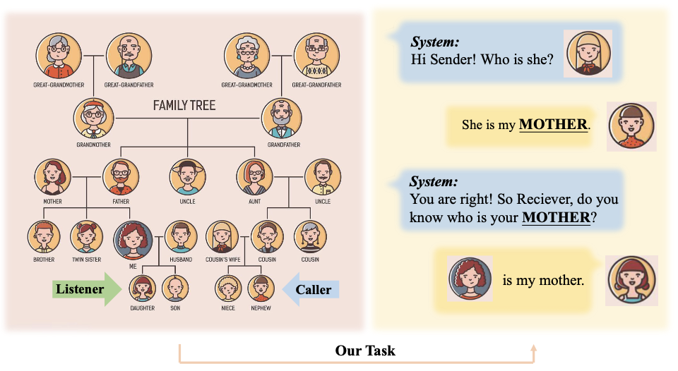
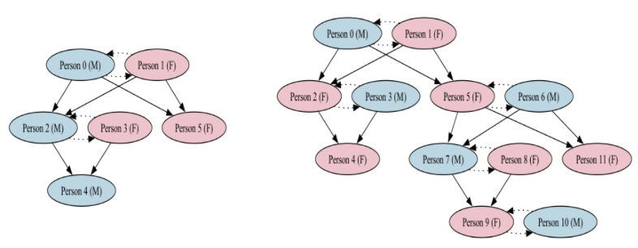
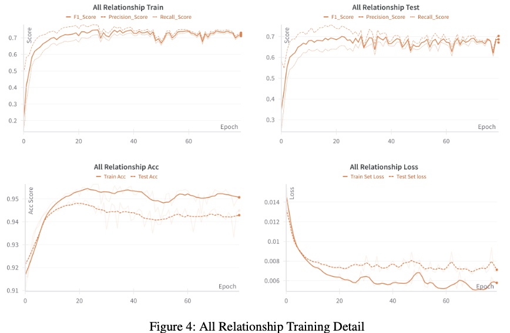
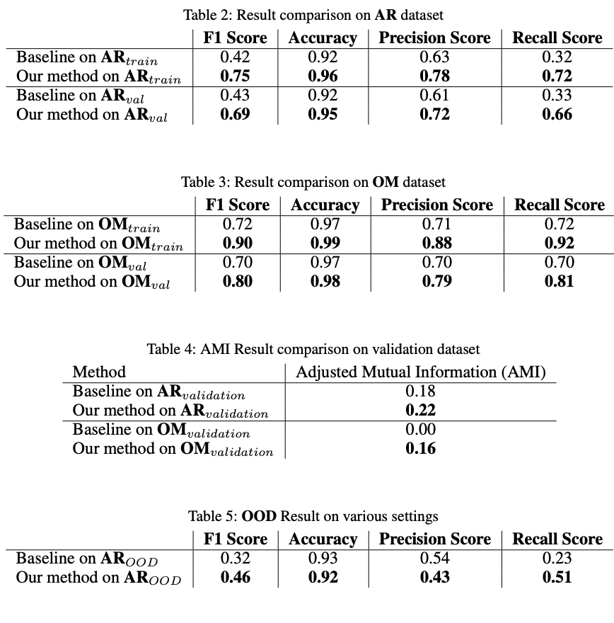

# Emergent-Language-For-Kinship-Terms

<p align="center">
    
    
    
</p>

## Environment Setup

To set up the environment, follow these steps:

1. Clone the repository.
```bash
git clone https://github.com/xkq1qkx/Emergent-Language-For-Kinship-Terms.git
## or 
git clone git@github.com:xkq1qkx/Emergent-Language-For-Kinship-Terms.git
```
2. Create a new env for project. Install the required dependencies.
```bash
conda create -n Kinship python=3.8
conda activate Kinship
pip install -e .
```
3. Run.
```bash
cd Emergent-Language-For-Kinship-Terms/mycode/
python test.py
## All the Parameters are in test.py 
```

## Table of Contents

- [Overview](#overview)
- [Task Description](#task-description)
- [Environment Setup](#environment-setup)
- [Run Training](#run-training)
- [Load Checkpoint For Test](#load-checkpoint-for-test)
- [Result](#Result)
- [Contributing](#contributing)
- [License](#license)


## Overview
Welcome to the Emergent Language for Kinship Terms project! This repository contains all the necessary code and resources to explore how kinship terms can emerge and evolve using machine learning techniques.


## Task Description


The task involves training a model to recognize and generate kinship terms based on given input data. The model's performance is evaluated using various metrics to ensure accuracy and reliability.


## Run Training

To run the training process, execute the following command:

```bash
python test.py
```

## Load Checkpoint For Test

Load a checkpoint and test the model:
See checkpoint at 
```bash
/Emergent-Language-For-Kinship-Terms/check_point/
```
## Result

## Contributing

We welcome contributions to this project! If you have any ideas, suggestions, or bug reports, please open an issue or submit a pull request.

## License

This project is licensed under the MIT License. See the [LICENSE](LICENSE) file for more details.
This project explores the emergence of language for kinship terms using machine learning techniques. The goal is to understand how kinship terms can develop and evolve in a simulated environment.